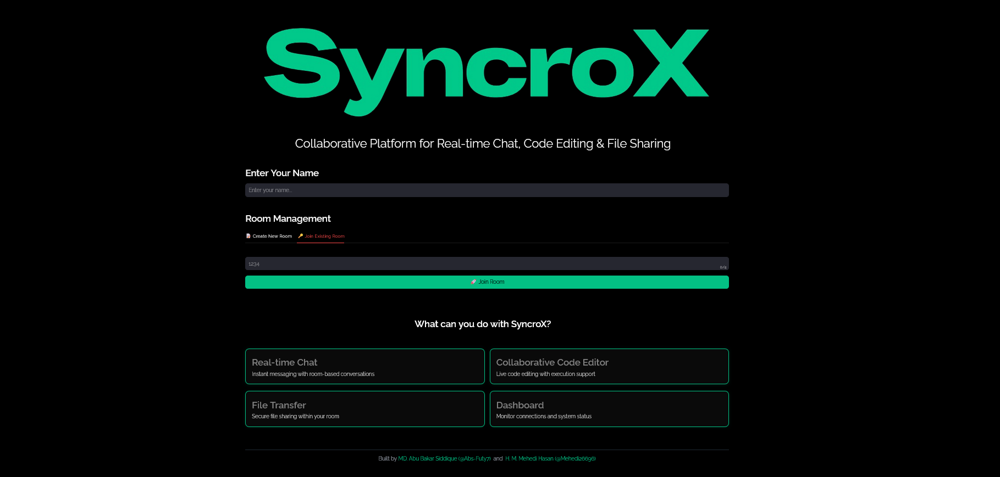
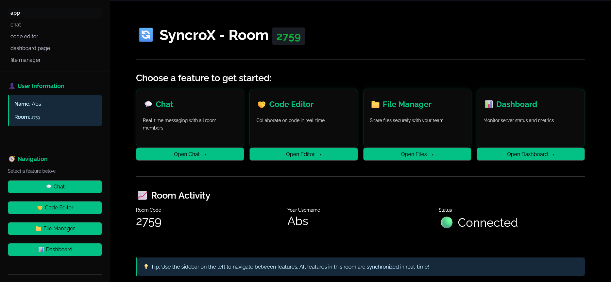
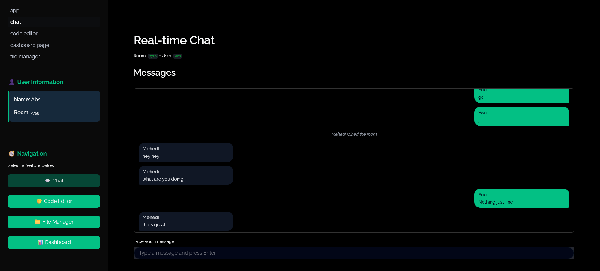
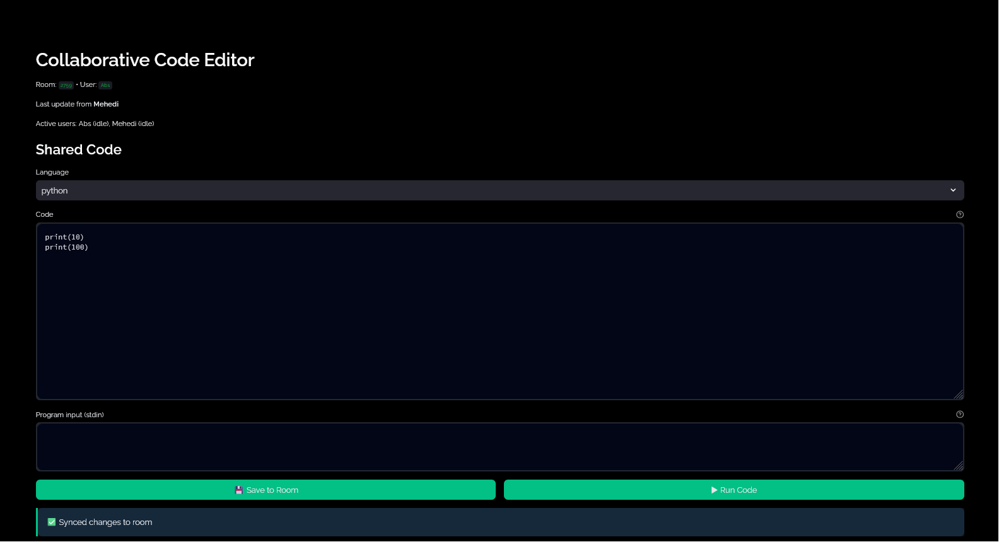
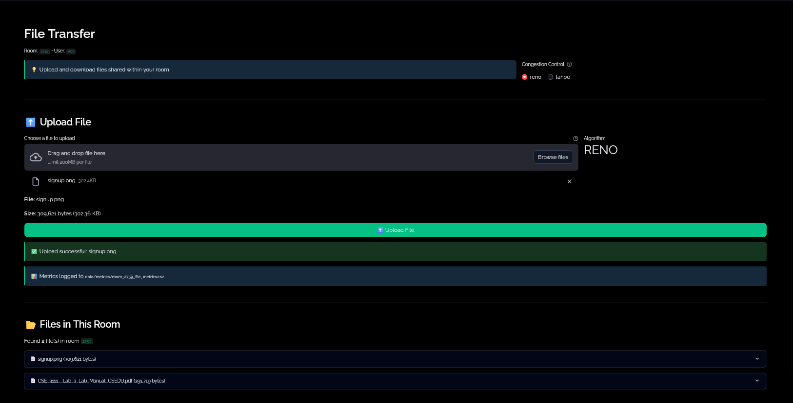
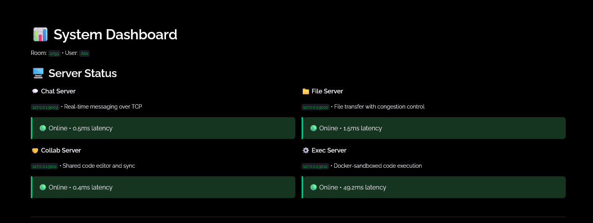
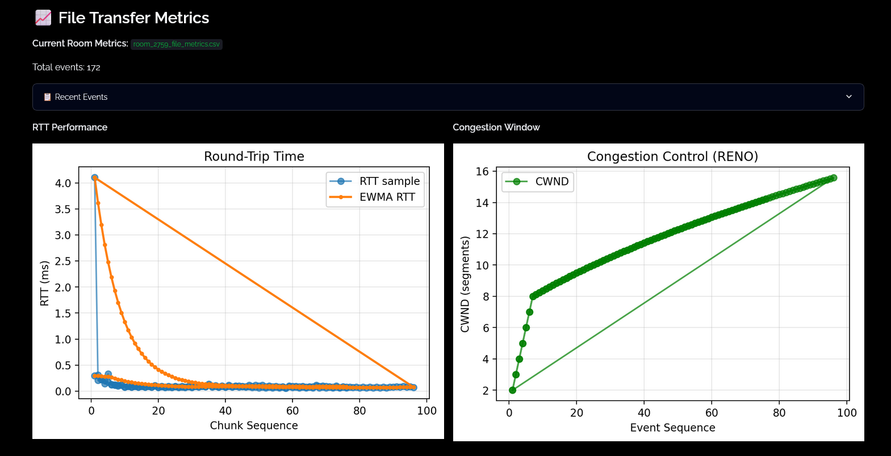

<p align="center">
  
</p>

# SyncroX - Real-Time Collaboration & Communication Platform

<p align="center">
  
  
  
  
  
</p>

**A production-grade collaborative platform demonstrating advanced networking concepts including custom Reliable UDP protocols, Tahoe/Reno congestion control, 3-way handshakes, cumulative ACKs, and secure Docker-based code execution.**

<p align="center">
  <a href="#key-features">Features</a> •
  <a href="#architecture">Architecture</a> •
  <a href="#installation--setup">Getting Started</a> •
  <a href="#networking-principles">Networking Principles</a> •
  <a href="#screenshots">Screenshots</a> •
  <a href="#contributing">Contributing</a>
</p>

---

**Course:** CSE 3111 - Computer Networking Lab  
**Authors:** H.M. Mehedi Hasan (13) • MD. Abu Bakar Siddique (47)

---

## Table of Contents

- [Overview](#overview)
- [Key Features](#key-features)
- [Architecture](#architecture)
- [Networking Principles](#networking-principles)
- [Installation & Setup](#installation--setup)
- [Usage Guide](#usage-guide)
- [Project Structure](#project-structure)
- [Technical Details](#technical-details)
- [Screenshots](#screenshots)
- [Troubleshooting](#troubleshooting)
- [Contributing](#contributing)

---

## Overview

SyncroX is a comprehensive, modular platform for real-time collaboration, file sharing, and code execution. It demonstrates advanced networking concepts including custom TCP protocol design, congestion control algorithms (Tahoe/Reno), RTT estimation, and secure sandboxed execution environments.

Built entirely with Python, Streamlit, and Docker, SyncroX provides a robust environment for teamwork and experimentation in computer networking, showcasing practical implementations of theoretical concepts.

### Why SyncroX?

- **Educational**: Hands-on implementation of networking protocols (TCP, flow control, congestion control)
- **Practical**: Real-world features like collaborative editing, chat, and file transfer
- **Secure**: Docker-based code execution sandbox with resource limits
- **Scalable**: Modular architecture with independent servers for each service
- **Modern**: Beautiful dark-themed UI with real-time updates

---

## Key Features

### 1. Real-Time Chat
- Room-based instant messaging
- Rate limiting (5 messages per 2 seconds)
- User presence tracking
- Message history per room
- Emoji and image support

### 2. Collaborative Code Editor
- Live code synchronization across multiple users
- Multi-language support: Python, C, C++, Java
- Real-time execution with Docker sandboxing
- Stdin/stdout support
- Syntax highlighting
- Active user indicators

### 3. Reliable File Transfer (UDP)
- **Advanced Reliability**: Custom layer over UDP with ARQ (Automatic Repeat Request)
- **Congestion Control**: Full implementation of Tahoe and Reno algorithms
- **Stateful Connections**: 3-way handshake (SYN, SYN-ACK, ACK) and 4-way termination
- **Sliding Window**: Efficient multi-packet in-flight management with cumulative ACKs
- **Instrumentation**: Real-time CWND, RTT, and Phase transitions logged to terminal
- **Data Integrity**: Binary-safe transfers with chunk-level sequence tracking

### 4. Dashboard
- Real-time server status monitoring
- RTT and congestion window metrics
- Network performance visualization
- Per-room analytics

### 5. Code Execution
- Sandboxed Docker execution
- Support for Python, C, C++, and Java
- Resource limits (256MB RAM, 0.5 CPU cores)
- No network access for security
- Execution time tracking
- Stdin/stdout handling

---

## Architecture

SyncroX follows a **client-server architecture** with four independent TCP servers:

```
┌─────────────────────────────────────────────────┐
│          Streamlit Frontend (Port 8501)         │
│  ┌──────────┬──────────┬──────────┬──────────┐  │
│  │  Chat    │  Editor  │  Files   │Dashboard │  │
│  └──────────┴──────────┴──────────┴──────────┘  │
└─────────────────────────────────────────────────┘
              │         │         │         │
         TCP  │    TCP  │    TCP  │    TCP  │
              ▼         ▼         ▼         ▼
┌──────────┐ ┌──────────┐ ┌──────────┐ ┌──────────┐
│  Chat    │ │  Collab  │ │ Reliable │ │   Code   │
│  Server  │ │  Server  │ │UDP File  │ │   Exec   │
│ Port:9009│ │ Port:9011│ │ Port:9011│ │ Port:9012│
└──────────┘ └──────────┘ └──────────┘ └──────────┘
                                              │
                                         Docker
                                         Sandbox
```

### Technology Stack

- **Frontend**: Streamlit, Python, Custom CSS
- **Backend**: Pure Python TCP servers (socket programming)
- **Execution**: Docker containers
- **Data**: CSV metrics, file storage, in-memory state
- **Networking**: Custom TCP protocols, binary transfers

---

## Networking Principles

### Custom TCP Protocols

#### Chat Server (Port 9009)
```
Commands:
- HELLO <username>       → OK Hello <username>
- CREATE_ROOM            → OK ROOM <code>
- JOIN_ROOM <code>       → OK Joined <code>
- MSG <text>             → OK Sent
- LIST_ROOMS             → ROOMS <count> <room1> <room2>...
- BYE                    → OK Bye

Features:
- Room-based broadcasting
- Rate limiting (5 msg/2s)
- Username tracking
- Automatic room cleanup
```

#### Reliable UDP File Transfer (Port 9011 / TCP 9010)
```
Commands (Control via TCP 9010):
- LIST <room>                      → FILES <count> <file1> <file2>...
- DOWNLOAD <room> <filename>       → Init UDP Transfer

Protocol (Data via UDP 9011):
1. Handshake: SYN → SYN-ACK → ACK
2. Transfer: Sliding Window DATA packets with Cumulative ACKs
3. Flow Control: CWND and ssthresh management (Tahoe/Reno)
4. Termination: FIN → FIN-ACK

Features:
- Fixed 4KB segments
- EWMA-based RTT/RTO (min RTO 200ms)
- Cumulative ACKs (ack = next_expected - 1)
- Fast Retransmit (on 3 duplicate ACKs)
- Timeout backoff protection
```

#### Collaborative Editor (Port 9011)
```
Commands:
- HELLO <username>       → OK Hello <username>
- JOIN <room>            → OK Joined + DOC <room> <size> <editor>
- SET <room> <size>      → OK SAVED
- GET <room>             → DOC <room> <size> <editor>
- USERS <room>           → USERS <room> <user1:status>,<user2:status>...
- BYE                    → OK Bye

Features:
- Real-time document sync
- Last-write-wins conflict resolution
- Active user tracking
- Language metadata support
```

#### Code Execution (Port 9012)
```
Commands:
- EXECUTE <room> <lang> <code_size> [<stdin_size>]
  → RESULT <success> <rc> <time_ms> <stdout_size> <stderr_size>

Languages: python, c, cpp, java

Security:
- Docker isolation
- Resource limits (256MB, 0.5 CPU)
- No network access
- 10-second timeout
```

### Congestion Control Implementation

**Tahoe Algorithm:**
1. **Slow Start**: CWND doubles every RTT (increases by 1.0 per ACK) until ssthresh.
2. **Congestion Avoidance**: CWND increases by 1/CWND per ACK (effectively +1.0 per CWND).
3. **On Packet Loss**: ssthresh = CWND/2, CWND = 1.0 (strict reset).

**Reno Algorithm:**
1. **Slow Start & Congestion Avoidance**: Same as Tahoe.
2. **Fast Retransmit**: Triggered by 3 duplicate ACKs.
3. **Fast Recovery**: ssthresh = CWND/2, CWND = ssthresh + 3. CWND increases by 1.0 per additional duplicate ACK.

**Reliability Mechanisms:**
- **Cumulative ACKs**: Every ACK reports the highest contiguous byte/packet received (`ack = next_expected - 1`).
- **RTT Estimation (EWMA)**:
  - `SRTT = (1 - α) × SRTT + α × RTT` (α = 0.125)
  - `RTTVAR = (1 - β) × RTTVAR + β × |SRTT - RTT|` (β = 0.25)
  - `RTO = max(SRTT + 4 × RTTVAR, 200ms)`
- **Orderly Termination**: 4-way FIN/FIN-ACK teardown ensures zero data loss during session closure.

---

## Installation & Setup

### Prerequisites

- **Python 3.8+** (tested on 3.10)
- **Docker** (for code execution)
- **Git**
- **pip** (Python package manager)

### Step 1: Clone the Repository

```bash
git clone https://github.com/Abs-Futy7/SyncroX.git
cd syncroX
```

### Step 2: Install Dependencies

```bash
pip install -r requirements.txt
```

Or if using a virtual environment (recommended):

```bash
python -m venv .venv
# On Windows:
.venv\Scripts\activate
# On Linux/Mac:
source .venv/bin/activate

pip install -r requirements.txt
```

### Step 3: Setup Docker

Ensure Docker is installed and running:

```bash
docker --version
docker pull python:3.10-slim
```

The code execution server uses the `python:3.10-slim` image as a base for sandboxing.

### Step 4: Start Backend Servers

Open **4 separate terminals** and run:

**Terminal 1: Chat Server**
```bash
cd backend/tcp_chat
python server.py
```

**Terminal 2: File Transfer Server**
```bash
cd backend/file_transfer
python server.py
```

**Terminal 3: Collaboration Server**
```bash
cd backend/collab
python server.py
```

**Terminal 4: Code Execution Server**
```bash
cd backend/code_exec
python server.py
```

You should see each server start and listen on its designated port.

### Step 5: Start Frontend

In a **5th terminal**:

```bash
streamlit run frontend/streamlit_app/app.py
```

The web interface will automatically open at `http://localhost:8501`.

---

## Usage Guide

### Creating/Joining a Room

1. **Open the app** in your browser (usually `http://localhost:8501`)
2. **Enter your username** on the welcome page
3. **Create a new room** (generates a 4-digit code) OR **Join an existing room** by entering the code
4. **Click "Let's Go!"** to enter the room

### Using Chat

1. Navigate to the **Chat** page from the sidebar
2. Type your message in the text box
3. Click "Send" or press Enter
4. Messages are broadcast to all users in the room
5. Supports emoji reactions and image sharing

### Collaborative Code Editing

1. Navigate to the **Code Editor** page
2. Select your programming language (Python, C, C++, Java)
3. Write your code in the editor
4. Changes auto-save every 2 seconds
5. Other users see updates in real-time
6. Enter stdin (if needed) in the "Program input" box
7. Click **"Run Code"** to execute
8. View output below the editor

### File Transfer

1. Navigate to the **File Manager** page
2. **Upload**: Click "Browse files", select file(s), choose congestion control algorithm, click "Upload"
3. **Download**: Click the download button next to any file
4. **Metrics**: View RTT and CWND graphs in real-time during transfers

### Dashboard

1. Navigate to the **Dashboard** page
2. View real-time server status (online/offline)
3. See active rooms and user counts
4. Analyze file transfer metrics and network performance

---

## Project Structure

```
syncroX/
├── assets/
│   └── logo.png                    # SyncroX logo
├── App_Screenshots/                # Demo screenshots
│   ├── landing_page.png
│   ├── chat_interface.png
│   ├── code_editor.png
│   ├── file_transfer.png
│   ├── dashboard.png
│   ├── System_Dashboard.png
│   └── FileTransferMetrices.png
├── backend/
│   ├── tcp_chat/
│   │   ├── server.py               # Chat server
│   │   └── client.py               # Chat client library
│   ├── file_transfer/
│   │   ├── server.py               # File server with congestion control
│   │   └── client.py               # File client library
│   ├── collab/
│   │   ├── server.py               # Collaborative editor server
│   │   └── client.py               # Collab client library
│   └── code_exec/
│       ├── server.py               # Code execution server
│       └── client.py               # Exec client library
├── data/
│   ├── metrics/                    # Per-room transfer metrics (CSV)
│   ├── collab_docs/                # Saved documents per room
│   ├── file_storage/               # Uploaded files per room
│   └── exec_output/                # Execution results
├── frontend/
│   └── streamlit_app/
│       ├── app.py                  # Main entry point (room login)
│       └── pages/
│           ├── chat.py             # Chat interface
│           ├── code_editor.py      # Collaborative editor
│           ├── file_manager.py     # File upload/download
│           ├── dashboard_page.py   # System dashboard
│           └── exec_output.py      # Execution history
├── tests/
│   ├── test_collab_concurrency.py  # Collab client stress test
│   └── repro_c_stdin.py            # C stdin issue reproduction
├── requirements.txt                # Python dependencies
├── docker-compose.yml              # (Optional) Docker orchestration
└── README.md                       # This file
```

---

## Technical Details

### Thread Safety & Concurrency

**Problem**: The initial `TcpCollabClient` used a single buffered I/O stream (`makefile("rwb")`) for both reading (in a background thread) and writing (from the main Streamlit thread), causing race conditions.

**Solution**: 
- Read channel: `sock.makefile("rb")` (read-only) in background thread
- Write channel: `sock.sendall()` directly from main thread
- This separation prevents buffer conflicts and ensures thread safety

### Docker Sandboxing

Code execution runs in isolated Docker containers with:
- **Image**: `python:3.10-slim`
- **Memory limit**: 256MB
- **CPU limit**: 0.5 cores
- **Network**: Disabled
- **Timeout**: 10 seconds
- **User**: Non-root
- **Interactive stdin**: `-i` flag for `scanf` support

### Congestion Control Metrics

Each file transfer logs:
- Chunk sequence numbers
- RTT per chunk (ms)
- Congestion window size (CWND)
- Slow start threshold (ssthresh)
- Algorithm used (Tahoe/Reno)

Metrics are saved to `data/metrics/<room>_<filename>_<timestamp>.csv` and visualized in real-time.

### State Management

- **Chat**: In-memory room→messages mapping
- **Files**: Disk storage in `data/file_storage/<room>/`
- **Documents**: Disk storage in `data/collab_docs/<room>.txt`
- **Users**: In-memory socket→username mapping per server

---

## Screenshots

<p align="center">
  
  <br/><em>Landing Page - Room Creation/Join</em>
</p>

<p align="center">
  
  <br/><em>Dashboard - Server Status & Analytics</em>
</p>

<p align="center">
  
  <br/><em>Chat Page - Real-time Messaging</em>
</p>

<p align="center">
  
  <br/><em>Collaborative Code Editor - Live Sync</em>
</p>

<p align="center">
  
  <br/><em>File Manager - Upload/Download with Congestion Control</em>
</p>

<p align="center">
  
  <br/><em>System Dashboard - Real-time Metrics</em>
</p>

<p align="center">
  
  <br/><em>File Transfer Metrics - RTT & CWND Visualization</em>
</p>

---

## Troubleshooting

### Port Already in Use

**Problem**: `OSError: [WinError 10048] Only one usage of each socket address`

**Solution**:
```powershell
# Windows - Kill process on specific port
Stop-Process -Id (Get-NetTCPConnection -LocalPort 9009).OwningProcess -Force

# Linux/Mac
lsof -ti:9009 | xargs kill -9
```

### Docker Not Running

**Problem**: Code execution fails with "Cannot connect to Docker daemon"

**Solution**:
- Start Docker Desktop (Windows/Mac)
- Or start Docker service: `sudo systemctl start docker` (Linux)

### Module Not Found

**Problem**: `ModuleNotFoundError: No module named 'streamlit'`

**Solution**:
```bash
pip install -r requirements.txt
```

### Streamlit Not Auto-Reloading

**Problem**: Changes to Python files don't trigger reload

**Solution**:
- Manually refresh the browser
- Or click "Always rerun" in Streamlit's top-right menu

### Live Sync Not Working

**Problem**: Code changes from one user don't appear for others

**Solution**:
1. Ensure collab server is running (`backend/collab/server.py`)
2. Refresh the browser for all users
3. Check that users are in the same room
4. Wait 2-3 seconds for auto-sync (configurable in `code_editor.py`)

### C/C++ Code Not Reading stdin

**Problem**: `scanf` or `cin` doesn't receive input

**Solution**: This was fixed in the latest version by adding the `-i` flag to `docker run`. Ensure you're using the latest code.

---

## Contributing

Contributions are welcome! Please follow these steps:

1. Fork the repository
2. Create a feature branch (`git checkout -b feature/AmazingFeature`)
3. Commit your changes (`git commit -m 'Add AmazingFeature'`)
4. Push to the branch (`git push origin feature/AmazingFeature`)
5. Open a Pull Request

### Code Style

- Follow PEP 8 guidelines
- Use meaningful variable names
- Add docstrings for functions
- Comment complex logic

---

## License

This project is licensed under the MIT License - see the LICENSE file for details.

---

## Acknowledgments

- **Course**: CSE 3111 - Computer Networking Lab
- **Institution**: [Your University Name]
- **Instructor**: [Instructor Name]
- **Semester**: [Semester/Year]

---

## Contact

For questions or issues, please contact:

- **H.M. Mehedi Hasan** - [@Mehedi26696](https://github.com/Mehedi26696)
- **MD. Abu Bakar Siddique** - [@Abs-Futy7](https://github.com/Abs-Futy7)

---

<p align="center"><b>SyncroX © 2025</b></p>
<p align="center">Built with passion for Computer Networking Lab</p>
