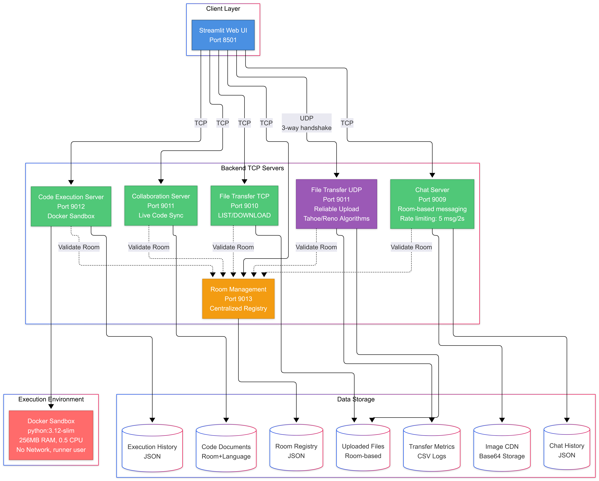

<!-- Animated Header Banner -->
<p align="center">
  
</p>

<h1 align="center">
  
</h1>

<p align="center">
  <strong>🌐 Advanced Real-Time Collaboration System</strong>
  <br/>
  <sub>A distributed networking system showcasing custom protocol implementations</sub>
</p>

<p align="center">
  <a href="#-quick-start"></a>
  <a href="#-screenshots"></a>
  <a href="https://github.com/Abs-Futy7/SyncroX"></a>
</p>

<p align="center">
  
  
  
  
  
</p>

<br/>

<!-- Fancy Divider -->
<p align="center">
  
</p>

## 🎯 What is SyncroX?

**SyncroX** is a **real-time collaborative and communication platform** demonstrating advanced networking concepts including custom TCP protocols, Tahoe/Reno congestion control, RTT estimation, and secure Docker-based code execution — all built entirely from scratch using Python sockets. It features reliable file sharing, instant messaging with image CDN, and synchronous collaborative editing.

<p align="center">
  
</p>

<br/>

## ⚡ Key Features

<table>
<tr>
<td width="50%">

### 📡 Reliable UDP Protocol
- Custom **RDT 3.0+** implementation
- Sliding windows with cumulative ACKs
- **Tahoe** & **Reno** congestion control
- Real-time RTT estimation

</td>
<td width="50%">

### 💬 Real-time Chat System
- Custom TCP application layer protocol
- **Image CDN** with lazy loading
- Instant message broadcast
- Persistent chat history

</td>
</tr>
<tr>
<td width="50%">

### 📝 Collaborative Code Editor
- Live document synchronization
- Multi-user editing support
- 500ms update frequency
- Last-Write-Wins conflict resolution

</td>
<td width="50%">

### 🐳 Secure Code Execution
- Docker-sandboxed environment
- Network isolation (`--network=none`)
- Resource limits (CPU, RAM, PIDs)
- Ephemeral containers

</td>
</tr>
</table>

<br/>

<p align="center">
  
</p>

## 📸 Screenshots

<details open>
<summary><strong>🖥️ Application Interface</strong></summary>
<br/>

<table align="center">
<tr>
<td align="center" width="50%">

<br/><strong>🏠 Home Dashboard</strong>
</td>
<td align="center" width="50%">

<br/><strong>📁 File Transfer</strong>
</td>
</tr>
<tr>
<td align="center" width="50%">

<br/><strong>💻 Code Editor</strong>
</td>
<td align="center" width="50%">

<br/><strong>⚡ Code Execution</strong>
</td>
</tr>
</table>

</details>

<details>
<summary><strong>📊 Congestion Control Analytics</strong></summary>
<br/>

<table align="center">
<tr>
<td align="center" width="50%">

<br/><strong>📈 RTT vs Chunk Sequence & CWND vs Event Sequence</strong>
</td>
<td align="center" width="50%">

<br/><strong>📈 Window Size vs Transmission Round</strong>
</td>
</tr>
</table>

</details>

<br/>

## 🏗️ Architecture

<p align="center">
  
</p>

<details>
<summary><strong>📋 Service Details</strong></summary>
<br/>

| Service | Port | Protocol | Description |
|:--------|:----:|:--------:|:------------|
| 🖥️ **Frontend** | `8501` | HTTP | Streamlit UI Gateway |
| 🔑 **Room Manager** | `9013` | TCP | Room lifecycle management |
| 💬 **Chat Service** | `9009` | TCP | Messaging & image CDN |
| 📂 **File Control** | `9010` | TCP | File listing & signaling |
| 📡 **File Data** | `9011` | UDP | Reliable data transfer |
| 📝 **Collab Service** | `9011` | TCP | Document synchronization |
| 🐳 **Exec Service** | `9012` | TCP | Docker code execution |

</details>

<br/>

<p align="center">
  
</p>

## 📡 Technical Deep Dives

<details>
<summary><strong>🔧 Reliable UDP Protocol</strong></summary>
<br/>

### Packet Structure (JSON over UDP)
```json
{
  "type": "DATA",           // SYN | SYN-ACK | ACK | DATA | FIN | FIN-ACK
  "seq": 105,               // Sequence Number
  "ack": 105,               // Acknowledgement Number
  "rwnd": 64,               // Receiver Window Size
  "room": "ABCD",           // Room context
  "filename": "doc.pdf",    // File context
  "payload_b64": "...",     // Base64 encoded chunk (4KB)
  "session_id": "a1b2c3d4"  // Session token
}
```

### RTT Estimation (Jacobson/Karels)
| Parameter | Formula | Value |
|:----------|:--------|:-----:|
| Smoothed RTT | `(1-α)·SRTT + α·RTTsample` | α = 0.125 |
| RTT Variance | `(1-β)·RTTVAR + β·|SRTT - RTTsample|` | β = 0.25 |
| RTO | `SRTT + 4·RTTVAR` | Min: 200ms |

### Congestion Control
| Event | Tahoe 🐢 | Reno 🦊 |
|:------|:---------|:--------|
| **Timeout** | CWND = 1, Slow Start | Same |
| **3 Dup ACKs** | CWND = 1, Slow Start | CWND = ssthresh + 3, Fast Recovery |

</details>

<details>
<summary><strong>💬 TCP Chat Protocol</strong></summary>
<br/>

### Command Reference
| Command | Direction | Description |
|:--------|:---------:|:------------|
| `HELLO <user> <room>` | C → S | Join room |
| `MSG <content>` | C → S | Send message |
| `IMG <filename> <b64>` | C → S | Upload image |
| `GET_IMG <filename>` | C → S | Fetch image |
| `BYE` | C → S | Disconnect |

### CDN Lazy Loading
| Step | Action | Description |
|:----:|:------:|:------------|
| **1** | 📤 Broadcast | Server sends metadata only |
| **2** | 🖼️ Render | Client shows placeholder |
| **3** | 📥 Fetch | On-demand binary request |
| **4** | 💾 Cache | Store in `backend/data/cdn/` |

</details>

<details>
<summary><strong>🛡️ Docker Security Profile</strong></summary>
<br/>

| Flag | Value | Purpose |
|:-----|:------|:--------|
| `--network` | `none` | Total network isolation |
| `--memory` | `256m` | Prevent RAM exhaustion |
| `--cpus` | `0.5` | Fair CPU scheduling |
| `--pids-limit` | `64` | Prevent fork bombs |
| `--rm` | `true` | Auto-cleanup containers |

</details>

<br/>

<p align="center">
  
</p>

## 🚀 Quick Start

### Prerequisites

```
✅ Python 3.10+     (required for match-case syntax)
✅ Docker Desktop   (must be running for code execution)
✅ pip              (for dependency management)
```

### Installation

```bash
# Clone the repository
git clone https://github.com/Abs-Futy7/SyncroX.git
cd SyncroX

# Create virtual environment
python -m venv venv
source venv/bin/activate  # Windows: venv\Scripts\activate

# Install dependencies
pip install -r requirements.txt

# Build Docker image
docker build -t syncro-sandbox ./backend/code_exec/

# Start servers
python start_all_servers_venv.py

# Launch frontend (new terminal)
streamlit run frontend/streamlit_app/app.py
```

> ⚠️ **Note:** Ensure Docker Desktop is running before starting the servers.

### Verify Installation

| Step | Action | Expected |
|:----:|:-------|:---------|
| 1 | Click "Create New Room" | 4-digit code appears |
| 2 | Open new tab, enter code | Join as second user |
| 3 | Send chat message | Instant delivery |
| 4 | Upload file | See congestion graph |
| 5 | Run code | Docker execution works |

<br/>

## 📁 Project Structure

```
SyncroX/
├── 📂 backend/
│   ├── 📂 code_exec/          # 🐳 Docker execution engine
│   ├── 📂 collab/             # 📝 Collaborative editor
│   ├── 📂 file_transfer/      # 📡 UDP file transfer
│   ├── 📂 room_mgmt/          # 🔑 Room management
│   └── 📂 tcp_chat/           # 💬 Chat protocol
├── 📂 frontend/               # 🖥️ Streamlit UI
├── 📂 App_Screenshots/        # 📸 Screenshots
├── 📂 assets/                 # 🎨 Branding
├── 📄 config.py               # ⚙️ Configuration
├── 📄 requirements.txt        # 📦 Dependencies
└── 📄 start_all_servers_venv.py  # 🚀 Launcher
```

<br/>

<p align="center">
  
</p>

## 👨‍💻 Authors

<p align="center">
  <a href="https://github.com/Mehedi26696">
    
  </a>
  &nbsp;&nbsp;&nbsp;&nbsp;&nbsp;&nbsp;&nbsp;&nbsp;
  <a href="https://github.com/Abs-Futy7">
    
  </a>
</p>

<p align="center">
  <a href="https://github.com/Mehedi26696"><strong>H.M. Mehedi Hasan</strong></a>
  &nbsp;&nbsp;•&nbsp;&nbsp;
  <a href="https://github.com/Abs-Futy7"><strong>MD. Abu Bakar Siddique</strong></a>
</p>

<p align="center">
  <a href="https://github.com/Mehedi26696">
    
  </a>
  &nbsp;
  <a href="https://github.com/Abs-Futy7">
    
  </a>
</p>

<br/>

---

<p align="center">
  <strong>Built with ❤️ using Python Sockets & Streamlit</strong>
</p>

<p align="center">
  
  
  
</p>

<p align="center">
  <sub>⭐ Star this repository if you found it helpful!</sub>
</p>
