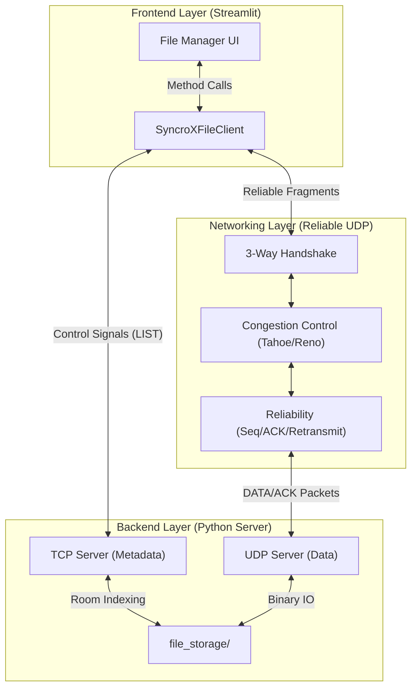
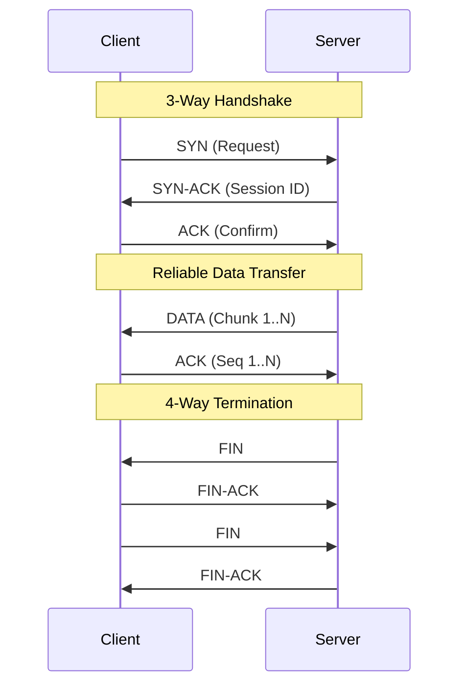

# SyncroX File Transfer System: Comprehensive Guide

SyncroX implements a custom **Reliable UDP Protocol** designed for efficient and robust file sharing. It bridges the gap between the speed of UDP and the reliability of TCP by implementing a custom transport layer that handles sequencing, acknowledgments, congestion control, and flow control.

---

## 🏗️ System Architecture

The following block diagram illustrates the split-plane architecture of SyncroX, showing how Control and Data flows are separated across TCP and UDP.



---

## 📦 Protocol Specification

### Packet Structure
All communication occurs via JSON-encoded packets. This ensures binary safety and allows for easy inspection.

| Packet Type | Direction | Purpose | Example Payload Snippet |
| :--- | :--- | :--- | :--- |
| **SYN** | Client → Server | Session Request | `{"type": "SYN", "room": "1234", "filename": "test.txt"}` |
| **SYN-ACK** | Server → Client | Accept + Token | `{"type": "SYN-ACK", "session_id": "8c3f2..."}` |
| **DATA** | Sender → Receiver| Payload Chunk | `{"seq": 42, "payload_b64": "SGVsbG8..."}` |
| **ACK** | Receiver → Sender| Confirmation | `{"ack_seq": 42, "rwnd": 32}` |
| **FIN** | Sender → Receiver| End of Stream | `{"type": "FIN"}` |

### Handshaking & Termination
SyncroX uses a **3-way handshake** for connection and a **4-way handshake** for teardown to ensure reliability.



---

## 📉 Congestion & Flow Control

### Tahoe vs. Reno Algorithms
You can toggle between these algorithms to handle network congestion differently.

*   **Tahoe**: Conservative. On loss (3 Dup ACKs), resets `cwnd` to 1.0 and restarts Slow Start.
*   **Reno**: Advanced. On loss (3 Dup ACKs), resets `cwnd` to `ssthresh` and continues with Congestion Avoidance (**Fast Recovery**).

### Flow Control (Dynamic `rwnd`)
The receiver advertises its available buffer space (`rwnd`) in every ACK packet.
*   **Sender Window Clipping**: `Window = min(cwnd, rwnd)`
*   **Backpressure**: If `rwnd` hits 0, the sender pauses until the receiver's application processes the data and opens space.

### RTO Estimation (EWMA)
Round Trip Time (RTT) is calculated for every acknowledged packet. We calculate the Smoothed RTT (SRTT) and Variation (RTTVAR) to determine the next **Retransmission Timeout (RTO)**:
`RTO = SRTT + 4 * RTTVAR` (Clamped to >= 200ms).

---

## 🚀 Usage Guide

### Integration Example
Developers can use the `SyncroXFileClient` to interact with the system programmatically.

```python
from backend.file_transfer.client import SyncroXFileClient

# Initialize with Reno algorithm
client = SyncroXFileClient(host="127.0.0.1", port=9010, algo="reno")

# 1. List files in room
files = client.list_files("1234")
print(f"Room 1234 Files: {files}")

# 2. Upload a file
with open("profile.png", "rb") as f:
    client.upload_bytes("1234", "profile.png", f.read())

# 3. Download a file
data = client.download_bytes("1234", "profile.png")
if data:
    with open("downloaded_profile.png", "wb") as f:
        f.write(data)

client.close()
```

---

## ⚙️ Configurable Parameters
Located in `config.py`:
- `CHUNK_SIZE`: Default 4096 bytes.
- `MAX_RETRIES`: Default 5 attempts per packet.
- `MIN_RTO`: Default 200ms for stability.
- `DEFAULT_RWND`: Default 32 packets buffer size.
